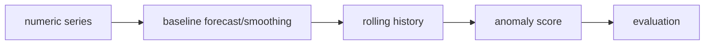

# Architecture

## Forecast baselines
Moving average and exponential smoothing provide interpretable predictions.

## Anomaly baseline
Rolling z-score compares a new observation with recent history.

## Evaluation
MAE provides a basic common scale for forecast comparison.

## Future layer
More complex models should be added only with side-by-side baseline evaluation.

## Design principle
A complex model should earn its complexity by beating simple baselines on frozen data.
